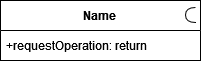
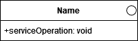
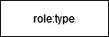

# SoaML Extension to Diagrams.net

## Click<a href="https://app.diagrams.net/?splash=0&clibs=Uhttps%3A%2F%2Fraw.githubusercontent.com%2Fgiva16%2Fdrawio-custom-lib%2Fmain%2FSOAML%2520Library%2FSoaML-General.xml;Uhttps%3A%2F%2Fraw.githubusercontent.com%2Fgiva16%2Fdrawio-custom-lib%2Fmain%2FSOAML%2520Library%2FSoaML-Interface.xml;Uhttps%3A%2F%2Fraw.githubusercontent.com%2Fgiva16%2Fdrawio-custom-lib%2Fmain%2FSOAML%2520Library%2FSoaML-Participant.xml;Uhttps%3A%2F%2Fraw.githubusercontent.com%2Fgiva16%2Fdrawio-custom-lib%2Fmain%2FSOAML%2520Library%2FSoaML-ServicesArchitecture.xml;Uhttps%3A%2F%2Fraw.githubusercontent.com%2Fgiva16%2Fdrawio-custom-lib%2Fmain%2FSOAML%2520Library%2FSoaML-ServiceContract.xml"> here</a> to load the SoaML Diagrams to diagrams.net

# 1 - Table of Notations
| Notation   |      Name      |  Description |
|----------|:-------------:|---------|
|  |  left-aligned | |
|  |    centered   | |
|  | right-aligned | |
|  |  left-aligned | |
|  |    centered   | |
|  | right-aligned | |
|  |  left-aligned | |
|  |    centered   | |
|  | right-aligned | |
|  |  left-aligned | |
|  |    centered   | |
|  | right-aligned | |

