<h1 style="text-align: center;"> SoaML Extension for Diagrams.net </h1>

# About

This extension is a collection of SoaML libraries that enables the user to draw SoaML diagrams within the <a>diagrams.net</a> web application and the <a>draw.io</a> desktop App created by <a>JGraph Ltd</a>. The diagrams in each library are based on the <a href="http://www.omg.org/spec/SoaML/">OMG SoaML specification</a>.

The SoaML extension for diagramas.net was developed as part of my bachelor's thesis at the Vrije Universiteit Amsterdam and is specifically designed to provide students of the <a href="https://studiegids.vu.nl/EN/courses/2022-2023/X_405061#/">Service Oriented Design</a> course taught by <a href="https://research.vu.nl/en/persons/patricia-lago">prof. dr. Patricia Lago</a> as part of the <a href="https://vu.nl/en/education/master/computer-science/curriculum?year=1st-year&specialization=software-engineering-and-green-it">Software Engineering and Green IT</a> track for the Master's in Computer Science at Vrije Universiteit Amsterdam with a lightweight open-source tool to draw SoaML diagrams for their course assignments. However, this extension is also open for use and modification by anyone who is interested in modeling SOA systems using the SoaML notations provided.

This extension provides the user with a collection of 5 SoaML libraries, with each library containing the elements for a specific SoaML diagram.

The 5 libraries are:

1. **SoaML-Interface:** For drawing Simple Interface and Service Interface Diagrams.
2. **SoaML-Participant:** For drawing Participant Diagrams.
3. **SoaML-ServiceContract:** For drawing Service Contract Diagrams.
4. **SoaML-ServicesArchitecture:** For drawing Services Architecture Diagrams.
5. **SoaML-Templates:** Examples of the aforementioned diagrams.

These libraries provide the user with the ability to specify services from different points of view, enabling the user to understand how different components provide and use services as well as how they interact with one another within a Services Oriented Architecture (SOA) system in order to to achieve a business goal.

# Table of Contents

- [What is SoaML?](#what-is-soaml)

- [Setting Up the SoaML Extension for Diagrams.net](#setting-up-the-soaml-extension-for-diagramsnet)

- [Drawing SoaML Diagrams in Diagrams.net](#drawing-soaml-diagrams-in-diagramsnet)

  - [What to expect from this tutorial?](#what-to-expect-from-this-tutorial)
  - [Drawing Service Interface Diagrams](#1-drawing-service-interface-diagrams)
  - [Drawing Participant Diagrams](#2-drawing-participant-diagrams)
  - [Drawing Service Contract Diagrams](#3-drawing-service-contract-diagrams)
  - [Drawing Services Architecture Diagrams](#4-drawing-services-architecture-diagrams)
      

- [SoaML Templates](#soaml-templates)

# What is SoaML?

Service Oriented Architecture Modeling Language (SoaML) is a tool specified and maintained by the <a href="https://www.omg.org/">Object Management Group (OMG)</a> that enables us to model services through the use of modified Unified Modeling Language (UML) notations. In order to fully understand the purpose of SoaML let us be reminded of what goes on in a Service Oriented Architecture (SOA) System. In SOA systems, participants exist in a community, or a distributed computing environment and they use and provide services in order to achieve a common goal which are usually tied to a business process. Participants can be defined as people, organizations, or different components of a system. A service is defined as a value that is exchanged. In order for participants to provide or use services, they must play the role of a service provider or a service consumer.

SoaML extends the UML profile to enable the specification of services in three possible approaches as described by the OMG SoaML Specification: The Simple Interface Approach, Service Interface Approach, and Service Contract Approach. Additionally, SoaML allows us to model a service network through the use of the Services Architecture diagram in order to describe how each participants collaborate as a community within a SOA system.

# Setting Up the SoaML Extension for Diagrams.net

### **Method 1 (Recommended): Directly importing the libraries package from the Github Repository to diagrams.net:**

**To import the libraries package directly from the Github Repository to diagrams.net simply click on this <a href="https://app.diagrams.net/?splash=0&clibs=Uhttps%3A%2F%2Fraw.githubusercontent.com%2Fgiva16%2Fdrawio-custom-lib%2Fmain%2FSOAML%2520Library%2FSoaML-General.xml;Uhttps%3A%2F%2Fraw.githubusercontent.com%2Fgiva16%2Fdrawio-custom-lib%2Fmain%2FSOAML%2520Library%2FSoaML-Interface.xml;Uhttps%3A%2F%2Fraw.githubusercontent.com%2Fgiva16%2Fdrawio-custom-lib%2Fmain%2FSOAML%2520Library%2FSoaML-Participant.xml;Uhttps%3A%2F%2Fraw.githubusercontent.com%2Fgiva16%2Fdrawio-custom-lib%2Fmain%2FSOAML%2520Library%2FSoaML-ServicesArchitecture.xml;Uhttps%3A%2F%2Fraw.githubusercontent.com%2Fgiva16%2Fdrawio-custom-lib%2Fmain%2FSOAML%2520Library%2FSoaML-ServiceContract.xml;Uhttps%3A%2F%2Fraw.githubusercontent.com%2Fgiva16%2Fdrawio-custom-lib%2Fmain%2FSOAML%2520Library%2FSoaML-Templates.xml">link</a>**, this link will directly import the libraries from the github repository to the diagrams.net web application's library manager. The libraries will be stored in the local storage of your web-browser.

**To Update the libraries:** Close the libraries in diagrams.net and click on this link again. This will update the libraries in the local storage of your web-browser.

**\*Note:** _This method does not allow the user to modify the libraries and templates and is not available for the offline diagrams.net desktop application._

### **Method 2 (Allows User to Modify Libraries and Templates): Downloading the repository and importing the libraries package to diagrams.net/draw.io desktop:**

1. Click on the link download the library package: <button><a href="https://download-directory.github.io?url=https://github.com/giva16/drawio-custom-lib/tree/main/SOAML%20Library" download>Download Library Package</a></button>

2. Extract the zip file to a folder of your choice.

3. Open the <a href="https://app.diagrams.net/">diagrams.net</a> web application or the draw.io desktop App.

4. Create a new blank diagram by clicking "Create New Diagram" > Select "Blank Diagram" > Click "Create".
   
5. Give your new diagram a name on the top left corner of the editor.
   

6.1 **To Load the library one by one** Click on "File" > "Open Library From" > "Device..." > Open the "SOAML Library" folder that you extracted in step 2 > Select the XML file of the library you want to load > Click "Open".

6.2 **To Load multiple or all libraries at once** Open the "SOAML Library" folder that you extracted in step 2 > Select all the XML files of the libraries you want to load > Drag and drop the selected files into the editor.

7. You can now view all the SoaML elements in the library panel on the left side of the editor and you have everything you need to start drawing SoaML diagrams.

   

   **Happy Drawing!**

# Drawing SoaML Diagrams in diagrams.net

## What to expect from this Tutorial?

This tutorial will guide the user on how to draw SoaML diagrams using the SoaML libraries provided by this extension. The tutorials will guide the user on how to draw the Service Interface Diagram, Participant Diagram, Service Contract Diagram, and Services Architecture Diagram. Each of the diagrams shown in this tutorial are derived from examples shown in the (2022-2023) edition of the Service Oriented Design (SOD) course at Vrije Universiteit Amsterdam, involving a "CityCar2Go" B2B (Business to Business) Services Architecture's participants and services.

### The tutorials are divided into four sections:

1. How to draw a Service Interface Diagram

2. How to draw a Participant Diagram

3. How to draw a Service Contract Diagram (Video Tutorial Included for the SOD Course)

4. How to draw a Services Architecture Diagram (Video Tutorial Included for the SOD Course)

### Each section will have a similar structure providing the following information in order:

1. Information about the diagram, detailing what the diagram is used for and what it represents.

2. Table of notations involved involved in the drawing of the diagram, detailing the elements of the diagram, what each notation represents and what it defines.

3. Step-by-step guide on how to draw the diagram in diagrams.net/draw.io desktop application.

Throughout the tutorials, GIF animations will be used to provide the user with additional visual guidance on how to setup the SoaML extension and draw SoaML diagrams using the SoaML libraries.

**Note:** viewing the GIF animations in full screen by clicking will provide a better quality viewing experience.

## 1. Drawing Service Interface Diagrams

### What is a Service Interface Diagram?

---

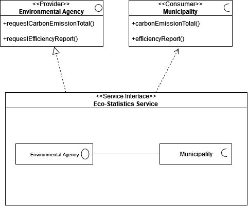

**Figure 1: Service Interface Diagram for an Eco-Statistics Service**

To understand what the SoaML Service Interface Diagram is about, let us be reminded that for a service provider to provide a service to a service consumer, the service provider must implement an interface for the consumer to establish a communication channel with the service provider. For a connection to be established between a service provider and a service consumer, the service provider must define the messages (signals and operations) that it can receive from the consumer by implementing a provided interface for the consumer and define the messages that it expects to be able to send back to the consumer (callbacks in a bi-directional interface) by specifying the provided interface that the consumer is to implement (modeled as a required interface from the perspective of the service provider).

The SoaML Service Interface Diagram specifies the interface that the service provider offers to provide the service logic that it owns to the service consumer and the interface that it expects the consumer to implement to receive callbacks from the provider; this defines a service with a bi-directional protocol. However, the SoaML Service Interface Diagram also allows for modeling a uni-directional interface known as a Simple Interface. In a Simple Interface Diagram, the service provider only specifies its interface to the consumer. It does not perform any callbacks to the consumer, defining a service with a uni-directional protocol.

Additionally, the Service Interface Diagram defines the roles that each participant involved within the service takes. In a bi-directional service, one participant may take the role of a service provider, thus implementing the specified provided interface in its service port. On the other hand, one participant may take the role of a service consumer, thus implementing the specified required interface in its service port.

Overall, the Service Interface Diagram defines the interactions between all of the participants involved in the service.

### SoaML Service Interface Diagram Notations

---

| Notation                                                                                                           | Name                   | Description                                                                                                                                                                                                                                                                                                                                                                                                                                                                                                                                 |
| ------------------------------------------------------------------------------------------------------------------ | :--------------------- | :------------------------------------------------------------------------------------------------------------------------------------------------------------------------------------------------------------------------------------------------------------------------------------------------------------------------------------------------------------------------------------------------------------------------------------------------------------------------------------------------------------------------------------------ |
|                   | Service Interface      | The Service Interface specifies the interface the service provider will implement through a realization association between itself and the **Provided Interface**. A bi-directional service will also specify the interface that the service provider expects from the service consumer by associating itself to the Required Interface with a usage association. Additionally, it defines the participants involved in the service and how they establish communication with one another.                                                  |
| 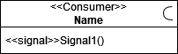 | Required Interface     | This represents the Required Interface of the service provider, which represents the interface that the service provider expects from the service consumer to allow for the service provider to perform callbacks to the service consumer. The interface is stereotyped as "Consumer" to indicate that the service consumer will implement this interface as its **Provided Interface**. Additionally, the Required Interface defines the set of messages that the service consumer can receive back from the service provider (callbacks). |
| 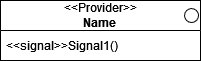                | **Provided Interface** | This represents the **Provided Interface** of the service provider, the interface is stereotyped as "Provider" which indicates that the service provider will implement this interface to provide the service that it owns to the service consumer. The service consumer will use this interface as its Required Interface. Additionally, the **Provided Interface** defines the set of messages that the service provider can receive from the service consumer when the service consumer uses the service owned by the service provider.  |
| 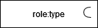              | Consumer Role          | This represents the role of a service consumer participant within a service. The service consumer's role is typed by the Required Interface.                                                       |
| 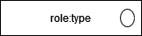             | Provider Role          | This represents the role of a service provider participant within a service. The service provider's role is typed by the specified Provided Interface.|                                            
| 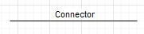                                  | Connector              | This is an association used to connect the Required Interface to the Provided Interface                           |
| 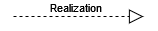                              | Realization            | This is the association between the Service Interface and the Provided Interface to indicate that the Service Interface implements the interface. |
| 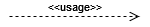                                          | Usage                  | This is the association between the Service Interface and the Required Interface to indicate that the Service Interface uses the interface as a Required Interface.|
| 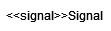                                     | Signal                 | This is a message that can be added to the set of defined messages that the service provider will receive or send in the specified interfaces.|

### How to draw a Service Interface Diagram in diagrams.net

---

1. Create a new diagram in diagrams.net and give it the name of the Service that you are modeling (e.g. Eco-Statistics Service).

2. Rename the page to any name you want (i.e. Service Interface Diagram).  
     

3. We will be drawing the Service Interface Diagram for a bi-directional **"Eco-Statistics Service"**, a service within the "CityCar2Go" service network. Start by navigating to the **SoaML-Interface** Library an selecting the **"Service Interface"** element. Drag and drop the element onto the canvas.  
     

4. Rename the **Service Interface** element to "Eco-Statistics Service".  
     

5. Next, we want to specify the **Provided Interface** that the service provider implements. To do this, navigate to the **SoaML-Interface** Library and select the **"Provided Interface"** element. Drag and drop the element onto the canvas, above the **Service Interface** Element. Give the **Provided Interface** the name "StatCenter", this will be the type of the Service Provider's role.  
     

6. The **Provided Interface** should specify the set of messages that the service provider can receive from the service consumer when the consumer is using the specified service. Our **Provided Interface** for the "Eco-Statistics" Service must specify the public operations "requestStat()" to represent an optional interaction by the consumer, requesting for a specific Eco-Statistic (i.e. Carbon Emissions, Gas Usage, Nitrogen Emission etc.) and "requestFullReport()" to represent the required interaction by the consumer, requesting for a full report of the Eco-Statistics. To specify the first operation, simply rename the Signal element inside the **Provided Interface** to "+requestStat()".  
     

7. Then, we need to add another operation to the **Provided Interface** for the "requestFullReport()" operation. To do this, navigate to the **SoaML-Interface** Library and select the "Signal" element. Drag and drop the element onto the **Provided Interface** element, below the "requestStat()" operation. Give the operation the name "+requestFullReport()".  
     

8. Finally, we'll have to give the **Service Interface** a Realization Association with the **Provided Interface** since the service provider will implement the **Provided Interface**. To do this, navigate to the **SoaML-Interface** Library and select the "Realization" element. Link the head of the arrow to the **Provided Interface** and the arrow's tail to the Service Interface. We may remove the association's label by clicking on the label and pressing the delete key to prevent the diagram from cluttering.  
     

9. Next, we want to specify the Required Interface that the service provider uses. To do this, navigate to the **SoaML-Interface** Library and select the "Required Interface" element. Drag and drop the element onto the canvas, next to the **Provided Interface** element. Give the Required Interface the name "StatConsumer"; this will be the Service Consumer's Role type.  
     

10. The Required Interface should specify the set of messages that the service provider can send back to the consumer. Our Required Interface for the "Eco-Statistics" Service must specify the public operations "stat()" and "fullReport()" to denote the service provider returning of the requested data to the service consumer. To specify the first operation, rename the Signal element inside the Required Interface to "stat()".  
      

11. Then, we need to add another operation to the required interface for the "fullReport()" operation. To do this, navigate to the **SoaML-Interface** Library and select the "Signal" element. Drag and drop the element onto the Required Interface, below the "+stat()" operation. Rename the Signal element to "+fullReport()".  
      

12. Finally, we'll have to give the **Service Interface** a Usage Association with the Required Interface since the service provider will use the Required Interface. To do this, navigate to the **SoaML-Interface** Library and select the "Usage" element. Link the association the same way as it was done for step 8.  
      

13. We'll have to specify the Service Provider's Role within the service. To do this, navigate to the **SoaML-Interface** Library and select the "Provider Role" element. Drag and drop the element into the **Service Interface** element, preferably on the same side as the **Provided Interface** element. Give the Provider Role a type of "StatCenter" to indicate that the Service Provider's role is typed by the **Provided Interface**.  
      

14. Next, we'll have to specify the Service Consumer's Role within the service. To do this, navigate to the **SoaML-Interface** Library and select the "Consumer Role" element. Drag and drop the element into the **Service Interface** element, preferably on the same side as the Required Interface element. Give the Consumer Role a type of "StatConsumer" to indicate that the Service Consumer's role is typed by the Required Interface.  
      

15. Connect the participant roles by navigating to the **SoaML-Interface** Library and selecting the "Connector" element, then linking the 2 roles to each other. We may remove the association's label by clicking on the label and pressing the delete key to prevent the diagram from cluttering.  
      

16. We have now completed the **Service Interface** Diagram for the "Eco-Statistics" Service. Save the diagram by going to File > Save As... then selecting the location you want to save the diagram and the format that you want to save the diagram as.  
      

## 2. Drawing Participant Diagrams

### What is a Participant Diagram?

---

**Figure 2: Participant Diagrams for a Service Provider named "Environmental Agency" and a Service Consumer named "Municipality"**

Service Participant Diagrams model the Participants that are defined by a Service Interface Diagram or a Simple Interface Diagram. Each participant represents software components, organizations, systems, or individuals that provide and use services. The ports of each Participant and their interfaces represent a service that is being offered or requested.

This diagram acts as an extension to the Service Interface Diagram, representing the roles that are defined as Participants represented by a UML Interface diagram stereotyped by "\<\<Participant\>\>". While the Service Interface Diagram is modeled from the perspective of the service provider, the Participant Diagram is drawn from perspectives of each participants, where the Participant providing a service implements the **Service Interface** as its Service Port, and the specified Required Interface and **Provided Interface** from the Service Interface Diagram as the Required Interface and **Provided Interface** of its service port respectively. On the other hand, the Participant using the service will conjugate the modeled Service Interface Diagram, using the **Service Interface** as a Request Port, and implementing the Required Interface as the **Provided Interface** of its Request Port.

The **SoaML-Participant** library enables us to model a Participant as a UML interface, indicating that it is a Participant within a bi-directional service, and model a Participant as a UML class, indicating that it is a Participant within a uni-directional service. Additionally, the library allows us to model the architecture of a Participant to specify the internal components that are involved in providing the Participant with a capability to offer or use a service.

### SoaML Participant Diagram Notations

---

| Notation                                                                                                | Name                              | Description                                                                                                                                                                                                                                                                                                                                                                                                                                                                                                                                                                          |
| ------------------------------------------------------------------------------------------------------- | :-------------------------------- | :----------------------------------------------------------------------------------------------------------------------------------------------------------------------------------------------------------------------------------------------------------------------------------------------------------------------------------------------------------------------------------------------------------------------------------------------------------------------------------------------------------------------------------------------------------------------------------- |
| 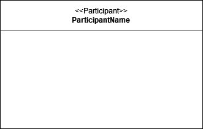                 | Participant                       | Defines a Participant within a service. This participant may implement a Service Port to provide a service, or implement a Request Port to request and use a service. Participants can be involved in multiple services and may implement multiple Service Ports and Request Ports, assuming the role of a service provider or service consumer in each service.                                                                                                                                                                    |
| 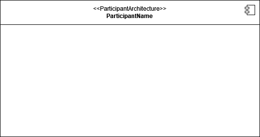 | Participant Architecture | This represents the Participant as a UML Composite structure to model how a Participant fullfill their roles in one or multiple Service Contracts in order order to offfer a defined Service, or how the Participant may delegate the the fulfillment of its roles within service contracts to one or multiple other participants. The Participant Services Architecture will then offer the service through a Service Port. The Participant Architecture must be combined with tools within the \*\*SoaML-ServicesArchitecture library to draw a Participant Architecture Diagram.                                    |
|                | Participant Class                 | Participants are modeled as UML classes when they are involved in uni-directional services modeled as a Simple Interface Diagram.                                                                                                                                                                                                                                                                                                                                                                                                                                                    |
| 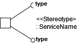             | Bi-directional Port               | This representation of a Service Interface and its Required and **Provided Interface** in a Participant Diagram. The UML Port notation denotes the **Service Interface** part of a **Service Interface** while the 2 attached interfaces denotes the specified required and provided interface form the **Service Interface** Diagram. The "\<\<Stereotype\>\>" label denotes that the Bi-directional Port can be stereotyped as a Service Port representing a **Service Interface**, or a Request Port representing a conjugated **Service Interface** being used by a participant. |
| 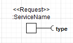                     | Request Port                      | This represents a conjugated **Service Interface** with, the Required Interface of the Request Port is typed by the **Provided Interface** that a **Service Interface** Implements.                                                                                                                                                                                                                                                                                                                                                                                                  |
| 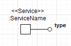                     | Service Port                      | This Represents a **Service Interface** that is being used by a Participant to offer a service to others, the **Provided Interface** on the Port is typed by the **Provided Interface** that is implemented by a **Service Interface**.                                                                                                                                                                                                                                                                                                                                              |
| 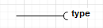          | Required Interface                | Represents a point of interaction for another participant that provides the type of the service requested.                                                                                                                                                                                                                                                                                                                                                                                                                                                                           |
| 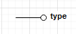          | **Provided Interface**            | Represents a point of interaction for another participant that requests for the type of service provided.                                                                                                                                                                                                                                                                                                                                                                                                                                                                            |

### How to draw a Participant Diagram in diagrams.net

---

1. Continuing from our modeling of the Service Interface Diagram, create a new page for the Participant Diagrams. Name this page after the diagram you are trying to model (i.e., "Participant Diagram").  
     

2. Our first step to drawing the diagram is to add a Participant, navigate to the **SoaML-Participant** library, select **"Participant"**, and drag it onto the canvas.  
     

3. We will be modeling the Service Consuming Participant. Name This Participant "Municipality." This Participant will consume the "Eco-Statistics" Service provided by the Service Provider.  
     

4. In the Service Interface Diagram, we have defined the "Eco-Statistics" Service as a **Service Interface** that is to be implemented by a Service Provider / Used by a Service Consumer to request the service. We have also specified that the Service Provider will implement the Required Interface that was specified in the Service Interface Diagram as their **Provided Interface**.  
   To model the **Service Interface** that the Consumer will use, we must navigate to the **SoaML-Participant** library and select the **"Bi-directional Port"** element. Drag the element onto any outer edge of the Participant.  
     

5. To make it easier to interact with the different parts of the Port, ungroup the Port by right-clicking on the Port and selecting "Ungroup".
     
     

6. Since The Participant "Municipality" is a Service Consumer, it will implement the Port as a **Request Port**, give the Port a stereotype "\<\<Request\>\>" to denote that it is a **Request Port**.  
     

7. The Request Port represents a **Service Interface** in a SoaML Participant Diagram. We'll have to name it after the **Service Interface** we've modeled previously in Part 1 of the tutorial. Name the Request Port "Eco-Statistics Service".   
     

8. The Service Consumer implements the **Provided Interface** of the **Service Interface** as the **Required Interface** of its **Request Port** since it conjugates the Service Port, name the **Provided Interface** "StatCenter".  
     

9. The Service Consumer implements the **Required Interface** of the **Service Interface** as the **Provided Interface** of its **Request Port**, name the **Provided Interface** "StatConsumer".  
     

10. Suppose that the Participant named "Municipality" consumes another service that provides "Location Awareness Service" capabilities. The Service Provider of the "Location Awareness Service" will offer the service through a **Provided Interface** called "LocationProvider" and will expect the Consumer to implement a "LocationRequestor" interface to interact with the Provider.
      We'll have to model this service as a **Request Port** by following the same rules stated in steps 4-9. You may have to adjust the diagram to make it look more presentable.  
      

11. Additionally, we have to model the Service Providing Participant (Service Provider) to show how the interfaces between 2 Participants can be connected if they are compatible. Since the Municipality conjugates the Service Interface, we must reverse the conjugation for the Service Provider Participant.   Create a **Participant** named "Environmental Agency" and give it a **Service Port** with the same name as the **Service Interface** from Part 1, with a **Required Interface** named "StatConsumer" and a **Provided Interface** named "StatCenter". You may have to make some adjustments to make the model more readable.  
      

12. We can now connect the compatible interfaces of the 2 Participants to represent an interacting pair of Participants within the "Eco-Statistics" Service. These Participants will interact by using or providing capabilities to each other, which will then progress to fulfilling a service, which can be a goal tied to a business.   
      

## 3. Drawing Service Contract Diagrams

### What is a Service Contract Diagram?

---

**Figure 3: Service Contract Diagram for the "Eco-Statistics" Service**

To understand what a Service Contract Diagram is, we need to understand the definition of a Service contract within SOA Systems. The Service Contract defines the terms, conditions, and interfaces of participants involved in enacting the service. Additionally, a Service Contract will define the order of participant interactions. The interactions of participants depend on their roles within a service. Each Participant is obliged to participate in enacting a service if they play a role specified by the Service Contract. The service is enacted when all participants have fulfilled their roles within the service by providing or using the signals and operations specified in their interfaces.

Previously, we have learned how to model 2 out of the 3 ways to specify a service (Simple Interface and Service Interface), now we move on to modeling the Service Contract approach for services. The SoaML Service Contract Diagram models each Participant's roles within the service specified by the UML collaboration. Additionally, SoaML Service Contract Diagrams may be accompanied by the participants that are bound within the Service Contract, which are modeled as interfaces stereotyped by "\<\<Provider\>\>" or "\<\<Consumer\>\>". The accompanying interfaces specify the messages that are exchanged between the participants that are involved in the enactment of the service; the order of the messages exchanged is defined by a UML Sequence Diagram, which usually accompanies a Service Contract Diagram to show the order of interactions between participants in the enactment of a service.

Our SoaML-ServiceContract library provides us with the tools to model a Service as a Service Contract Diagram, specifying the participants involved \(shown inside the Service Contract\) and their roles. The library also provides us with additional notations that extend the capabilities of a UML Sequence Diagram to model the choreography of the service. Furthermore, other libraries, such as the SoaML-Participant library and SoaML-Interface library, can be utilized to extend the details of the service model by a Service Contract Diagram.

### SoaML Service Contract Diagram Notations

---

| Notation                                                                                               | Name                    | Description                                                                                                                                                                                                                                                                                                                                                                                                                                              |
| ------------------------------------------------------------------------------------------------------ | :---------------------- | :------------------------------------------------------------------------------------------------------------------------------------------------------------------------------------------------------------------------------------------------------------------------------------------------------------------------------------------------------------------------------------------------------------------------------------------------------- |
| 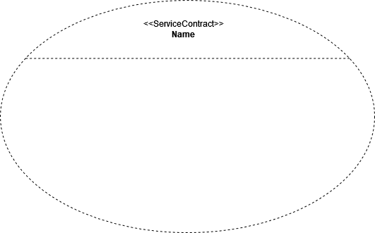               | Service Contract        | Represents the Service Contract, defining the roles that participants play within the enactment of a service. The roles of each participant will be contained within this diagram.                                                                                                                                                                                                                                                                       |
| 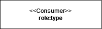                         | Consumer Role           | Represents a Participant Playing the role of the service consumer within the enactment of the service. The semi-circle on the top right denotes that the participant implements the required interface from the perspective of the service provider.                                                                                                                                                                                                     |
| 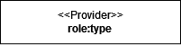                         | Provider Role           | Represents a Participant Playing the role of the service provider within the enactment of the service. The circle on the top right denotes that the participant implements the provided interface.                                                                                                                                                                                                                                                       |
| 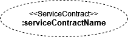        | Nested Service Contract | Represents a Service Contract that needs to be fulfilled to fulfill the roles that each Participant in the service play.                                                                                                                                                                                                                                                                                                                                 |
| 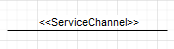                 | Service Channel         | This represents a communication channel between the 2 participants. When it connects 2 participants, it denotes that the participants with a service channel between them can exchange messages (signals or operations). The exchange of messages can be further specified in UML behavior diagrams.                                                                                                                                                     |
| 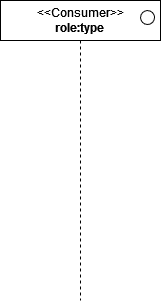 | Consumer Lifeline       | This represents the lifeline of the Consumer participant. We can then model the messages sent by the participant as a solid line with a filled arrow labeled by the operation and pointing away from the participant and toward another participant or itself. The circle on the right is added as an extension to the UML profile. This circle denotes that the participant implements an interface to send the message (operation call) to a provider. |
|  | Provider Lifeline       | Represents the lifeline of a Provider participant. Since a provider can make a callback (return message in response to an operation call) to a consumer, this callback message is denoted as a dashed line with an unfilled arrow, labeled by the return message, pointing back towards the caller (consumer). Additionally, a provider can also make a call to another provider; for instance, in a multi-party service.                                |

### How to draw a Service Contract Diagram in diagrams.net

---

1. Start by creating a new page or new diagram and name it "Service Contract Diagram".  

2. In this tutorial, we will define the "Eco-Statistics" service through the third approach to defining services in SOA, known as the "Contract-Based Approach". To start off, let's add the Service Contract UML collaboration to the canvas.  Navigate to the **"SoaML-ServiceContract"** library and drag the **"Service Contract"** element onto the canvas and name the **Service Contract** "Eco-Statistics".  
   

3. As previously specified by the **Service Interface** approach to defining the "Eco-Statistics" service, there were 2 **Participant Roles** in the service. We will have to specify this also for the **Service Contract** Approach.  Specify the Consumer Participant's role in the service by navigating to the **"SoaML-ServiceContract"** library and dragging the **"Consumer Role"** element into the left side of the **Service Contract**.  
   

4. Give it a role "Consumer" and type the role as "StatConsumer"; this is the name of the **Required Interface** that we have specified in Part 1 of the tutorial. Recall that the role of a Participant is typed by the Interface that they implement.  
   

5. Next, we will specify the Provider Participant's role in the service by navigating to the **"SoaML-ServiceContract"** library and dragging the **"Provider Role"** element into the right side of the **Service Contract**.  Name the role as "Provider" and type the role as "StatProvider", since the **Provided Interface** of a Provider Participant types the role of the Provider.  
     

6. Finally, we must now model establishing a **Service Channel** between the 2 Participants involved in enacting the service. To do this, navigate to the **"SoaML-ServiceContract"** library, drag the **"Service Channel"** element onto the canvas, and connect the **Consumer Role** and **Provider Role** with the **Service Channel**. Delete the label to make the diagram more readable.  
    
   We have modeled a Service Contract that defines the "Eco-Statistics" service, showing each Participant's role in enacting the service. Additionally, we can accompany a Service Contract Diagram with a UML Sequence Diagram to show the order of interactions between the Participants in the enactment of the service.  

7. To extend the Service Contract Diagram's definition of the service, we can add a **UML Sequence Diagram** or a set of **UML Interfaces** showing the operations that each of the Participants expect from one another depending on their roles, as shown in the **Required Interface** and **Provided Interface** in the Service Interface Diagram. The figure shown below serves to remind us of the **Required Interface** and **Provided Interface** that we have modeled in the Service Interface Diagram.  
   

8. To specify the Choreography of the Service, we need to model a **UML Sequence Diagram** that shows the order of interactions between the Participants in the enactment of the service. First, we need to specify the Consumer's Lifeline. Navigate to the **"SoaML-ServiceContract"** library, select the **"Consumer Lifeline"** element, and drag it onto the canvas.  
     

9. Give the **Consumer Lifeline** a role type of "StatConsumer" since the consumer role is typed by the **Required Interface** of the service.  
   For readability purposes, we can omit the role name itself (i.e. ": StatConsumer" instead of "Consumer: StatConsumer").  
   

10. Specify the **Provider Lifeline** by navigating to the **"SoaML-ServiceContract"** library, selecing the **"Provider Lifeline"** element, and dragging it onto the canvas.  
      

11. Give the role a type of "StatCenter" since it is typed by the **Provided Interface** of the service. Use the same naming convention as step 10.  
    

12. You may have to adjust the length of the Lifelines by dragging the bottom of the Lifeline, as shown below.  
    

13. Add the activation bars to the Lifelines. These activation bars indicate the duration that a Participant is active in enacting the service. To do this, navigate to the **"UML"** library, select the **"Activation Bar"** element, and drag it onto the Lifeline.  For our case, the Service Provider will no longer be active once it has sent the callback message. Therefore, we must make the Provider's **Activation Bar** end upon the Consumer's receipt of the callback message. However, the Consumer may still be active after it has received a callback message since it might want to perform tasks involving the returned data carried in the callback message. So we'll have to make the Consumer's **Activation Bar** longer.  
    
    

14. To model the sending of a message from the Consumer to the Provider, navigate to the **"UML"** library, select the **"Message"** element, and drag it onto the canvas. Connect the **Consumer Lifeline** to the **Provider Lifeline** with the **Message** arrow.  
      

15. Name this message "requestStat", and give it a number "1" to denote that it is the first interaction between the 2 participants.  
      

16. Next, we'll need to model the callback from the Provider to the Consumer. To model this, navigate to the **"UML"** library, select the **"Return"** element, and drag it onto the canvas. Connect the **Provider Lifeline** to the **Consumer Lifeline** with the arrow pointing towards the **Consumer Lifeline** arrow.  
      

17. Name this return message "stat" to denote the Provider returning data which shows the statistic requested by the Consumer, and give it a number "2" to denote that it is the second interaction between the 2 participants.  
      

18. Interactions number 1 and 2 are optional (refer to step 6 of Part 1). We'll need to model this by containing the interactions, a section of the Lifeline, and the activation bars within an **"Opt"** **Frame**. To do this, navigate to the **"UML"** library, select the **Frame** element, and drag it onto the canvas; make sure that it covers the part of the **Lifeline** and the **Activation Bars** involved in the interactions. Name the **Frame** as **"Opt"**   
      

19. The required interactions between the 2 participants are the **"requestFullReport"**, denoting the Consumer requesting a full report on Environmental Statistics from the Provider, and **fullReport**, and the Provider returning the requested document to the Consumer.  
    Modeling the required interaction will result in the UML Sequence Diagram shown below.  
    

### More on Service Contract Diagrams

---

The service contract we modeled in this tutorial was 1 of the three services involved in the "CityCar2GO" service network. The other 2 services are the "Location Awareness" and the "Banking" services. The video tutorial for the Service Oriented Design course will cover how to model all three service contracts and export the diagram as an image and save it as a template. Be sure to Check it out!

## 4. Drawing Services Architecture Diagrams

### What is a Services Architecture Diagram?

**Figure 4: Services Architecture Diagram for the "CityCar2Go" Service Network**

The SoaML Services Architecture Diagram models Participants collaborating in a community to fulfill a common goal, it is a UML collaboration that models the internal structure of a SOA System, showing how each participants consume and use services to fulfill a purpose. The Services Architecture Network defines the requirements of each Participant to realize a service depending on their roles. Each Participant is bound to a Services Architecture by their role in it but is not limited to just one Services Architecture. For instance, multiple Services Architecture Networks may use the same Participant to fulfill a Service Contract that requires the same Participant to fulfill the same role. Overall, the Services Architecture Diagram provides the highest level view of how each independent Participants work together to achieve a mutual goal.

The **SoaML-ServicesArchitecture** library lets us specify the Participants involved in a Services Architecture Network (external and internal) and how their role binds them to the network to show each Participant in a community would collaborate to fulfill a mutual goal.

### SoaML Services Arthitecture Diagram Notations

| Notation                                                                                                       | Name                      | Description                                                                                                                                                                                                                                                                                                                                                                                                 |
| -------------------------------------------------------------------------------------------------------------- | :------------------------ | :---------------------------------------------------------------------------------------------------------------------------------------------------------------------------------------------------------------------------------------------------------------------------------------------------------------------------------------------------------------------------------------------------------- |
|                  | Services Architecture     | ServicesArchitecture describes how a network of Participants work together by providing and consuming services to fulfill a mutual goal. Participants from outside and inside the Services Architecture may be bound to the Services Architecture Network depending on their role. Services are defined as Service Contracts within this diagram and Participants fulfill the services through their roles. |
|  | Internal Service Contract | This denotes a Service that is a part of the Services Architecture Network. Participants are bound to the Services Architecture due to the Service Contracts that are involved in the network. For clarity, **"\<\<Service Contract\>\>"** stereotype is included.                                                                                                                                          |
|                  | Internal Participant      | This denotes a Participant belonging within the Services Architecture that they are bound to. The role of the Participant is typed by the Provided Interface they implement. For the sake of readability and clarity, the Participants are modeled as UML classes stereotyped by **"\<\<Participant\>\>"** and only their role type is included in the labeling                                             |
|                  | External Participant      | This represents a borrowed Participant belonging to another Services Architecture. This Participant is bound to the Services Architecture we are modeling due to the fact that their role type bounds them to one of the Service Contracts specified in the Services Architecture Network.                                                                                                                  |
|        | Role Binding              | A role binding attaches a participant with a compatible interface to the service contract within the architecture; describing their role in fulfilling a service.                                                                                                                                                                                                                                           |

### How to draw a Services Architecture Diagram in diagrams.

1. To model the "CityCar2Go" Service Network, we will need to model its Services Architecture Diagram. Start by navigating to the **"SoaML-ServicesArchitecture"** library, then drag the **"Services Architecture"** element onto the canvas.  
     

2. We must name the Services Architecture Diagram after the Network that we are trying to model, give the **Services Architecture** the name "CityCar2Go".  
     

3. First, we will specify the "Eco-Statistics" service and how its participants fulfill it within the Services Architecture Network. To do this, navigate to the **SoaML-ServicesArchitecture** library, then drag the **"Participant"** element into the **Services Architecture**.  
     

4. The first **Participant** we specify is the Service Consumer; therefore, we need to give its role the type "Municipality". As shown in Part 1-2, the Municipality uses the "Eco-Statistics" service. We do not need to include the role name since the **Role Binding** element will do so for us.  
     

5. Now, we want to include the service that this ParticipantParticipant is involved in. To do this, we must navigate to the **SoaML-ServicesArchitecture** library, then drag the **"Internal Service Contract"** element into the **Services Architecture**.  
     

6. Name the **Internal Service Contract** element after the service that it represents, in this case, "Eco-Statistics".  
     

7. Bind the Service Consumer to the Service Contract since it uses the service. Navigate to the **SoaML-ServicesArchitecture** library, then drag the **"Role Binding"** element into the **Services Architecture**. Connect the **Role Binding** line to the **Participant** and **Internal Service Contract**.  
     

8. Since the "Municipality" is a Consumer of the "Eco-Statistics" service, we'll need to label the **Role Binding** element as "Consumer."   
     

9. Add the second ParticipantParticipant to the Services Architecture. This ParticipantParticipant will be the Service Provider. To do so, navigate to the **SoaML-ServicesArchitecture** library, then drag the **"Participant"** element into the **Services Architecture**.  
     

10. Give the Service Provider's role a type of "Environmental Agency".  
      

11. Bind the Provider to the "Eco-Statistics" service contract the same way we did for the Consumer in step 7\. The Environmental Agency is the Service Provider, so we'll label the role binding as "Provider".  
      

We have now completed modeling the "Eco-Statistics" service within the "CityCar2Go" Service Network. To model the "Location Awareness" and "Banking" services, we'll have to repeat steps 3-11 and give the **Participant**, **Internal Service Contract**, and **Role Binding** elements the appropriate names and types. Use **Figure 4** (shown at the start of this section) to reference the final diagram.

The completed specification of all services and participants within the "CityCar2Go" Service Network, modeled in diagrams.net with the SoaML extension, is shown in **Figure 4** above.

### More on Services Architecture Diagrams

At this point, we can see, with the assistance of the Services Architecture Diagram, how the Interface-based and Contract-based approaches to defining Services intertwine with one another. The roles of the Participants are typed and defined by the fact that they implement the **Required Interface** or **Provided Interface** of a **Service Interface** or whether they Implement or use the **Provided Interface** in a **Simple Interface**. Moreover, the binding of each Participant to the Services Architecture is defined by their roles.

#### The Services Architecture for Participants

With a combination of the **SoaML-Participant** library and the **SoaML-Services Architecture Library**, we are able to model the internal structure of a Participant to show how it implements its service ports and how it delegates the fulfillment of its roles within a service contract to other participants. The figure below shows the internal structure of the "Manufacturer" Participant, based on an example from OMG's SoaML Specification.  

**Figure 5: Internal Architecture of a Manufacturer Participant.**

Figure 5 shows how the Manufacturer Participant delegates the notification of order fulfillments denoted by the **"Order Complete Service"** **Service Contract** to another participant named **"Order Processing"**. The **Order Processing** participant acts as the provider of the **Order Complete Service**, notifying the **"Accounting"** Participant when an order is completed.

Moreover, the Participants **"Accounting"** and **"Order Processing"** are also bound to the **Invoicing Service** and **Ordering Service** respectively, therefore the **"Manufacturer"** participant delegates the fulfillment of the roles of types **"payer"** and **"order processor"** to the **"Accounting"** and **"Order Processing"** participants respectively. Their role types denote that the **"Accounting"** participant is a consumer of the **Invoicing Service** and the **"Order Processing"** participant is a provider of the **Ordering Service**. Finally, the **"Manufacturer"** participant delegates the fulfillment of the **Invoicing Service's** consumer role and the **Ordering Service's** provider role to an external participant under the role type **"Seller"**.   

We can also represent the **Participant Architecture** as a UML Collaboration Structure with the **Services Architecture** diagram. In this case, we'll have to remove the typing of each role, replacing them with either **Consumer** or **Provider**, and we'll have to give the **Services Architecture** part of the diagram a **realization** association with the ParticipantParticipant we are modeling; to do this, we'll need the **Realization** arrow from the **SoaML-ServicesArchitecture** library and the **Participant Class** (UML class) element from the **SoaML-Participant** library. The figure below shows the **Services Architecture** of the **"Manufacturer"** participant.  

**Figure 6: The Internal Architecture of a Manufacturer Participant converted from a Participant Architecture composite structure to a Services Architecture collaboration structure.**

# SoaML Templates

Below are the templates for each of the SoaML Diagrams that we have covered in this tutorial. You can use these templates to start modeling your own SoaML Diagrams in diagrams.net.
Additionally, we've included a multi party sequence diagram template to show how a party of 3 partiicpants would interact with each other to fulfill a service. The service contract that these participants are involved in would be modelled as a Service Contract Diagram with 3 participants.

## Service Interface Diagram Template

## Participant Diagram Template

## Service Contract Diagram Template

### Service Choreography Template (Dual Party)

---

### Service Choreography Template (Multi-Party)

---

## Services Architecture Diagram Template

